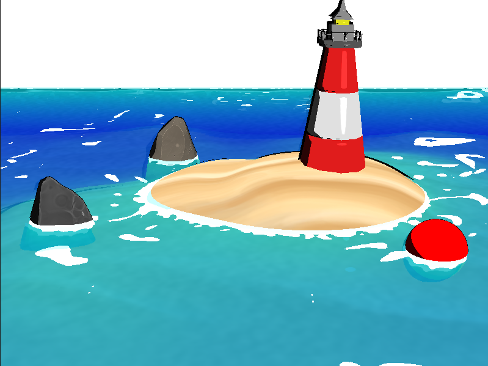

# Stylized Water scene for Computer Graphics for Games


# Dependencies Instructions
[Download dependencies](https://drive.google.com/file/d/1wOciHD5nIUU5JmBiFdTUDR8-Xo5QZBfb/view?usp=drive_link)

Unzip the ```dependencies.zip``` file to a folder named dependencies in the root of the project. 

# Credits for models and textures

"Low Polygon Stylized Rock [FREE]" (https://skfb.ly/o6s7H) by Jesus Fernandez Garcia is licensed under Creative Commons Attribution (http://creativecommons.org/licenses/by/4.0/).

"Stylized Rock" (https://skfb.ly/6AwWP) by dagos32 is licensed under Creative Commons Attribution-NonCommercial (http://creativecommons.org/licenses/by-nc/4.0/).

lighthouse credits: https://free3d.com/3d-model/lighthouse-222865.html
